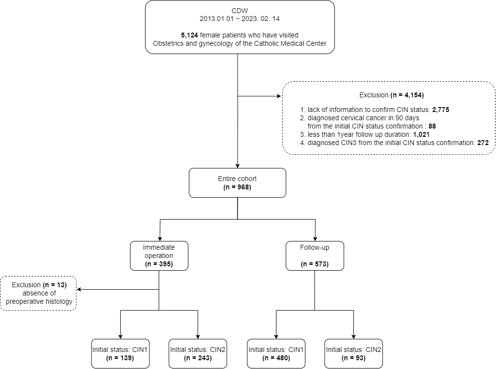
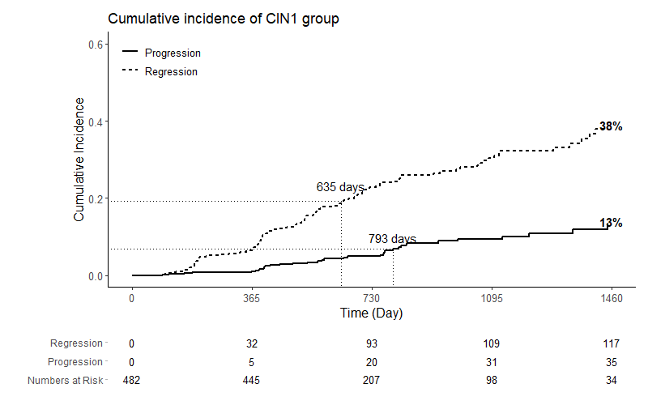
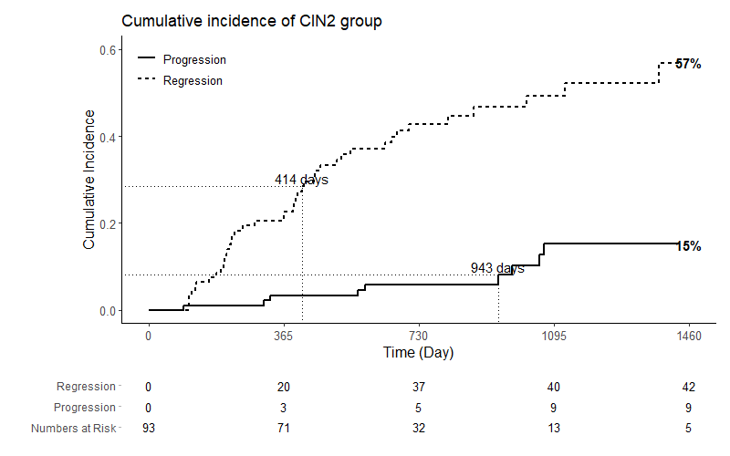
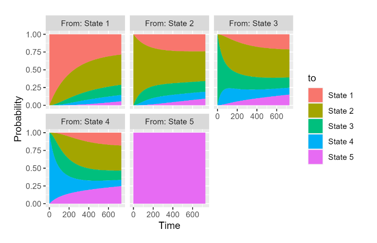

# Basic concept of the study
Possibility of observation strategy compared with immediate surgical treatment for cervical intraepithelial neoplasia 1, 2 in South Korea based on a multi-institution retrospective cohort analysis.

[flow chart of the study]

[Regression of CIN2 definition and number of them]

# Preliminary results
[Cumulative incidence of CIN1 with median f/u time]

[Cumulative incidence of CIN2 with median f/u time]

[Stacked plot_multi-state analysis]

